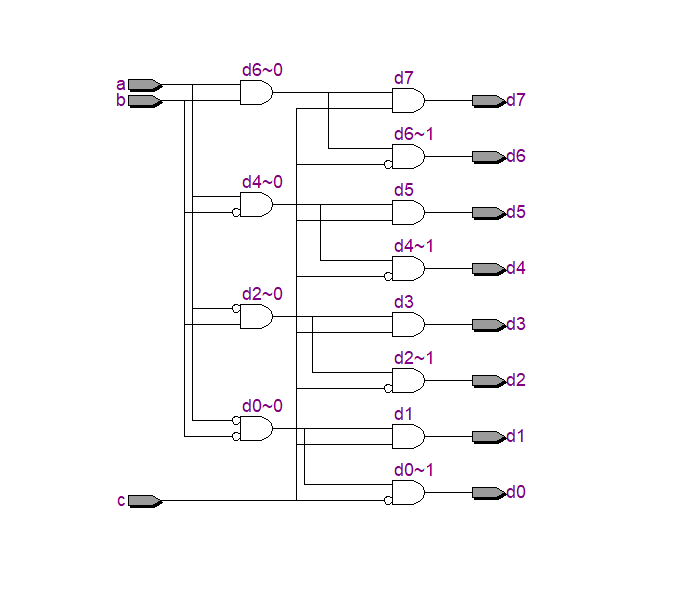
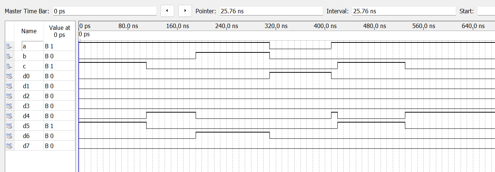

### Ex. No. 8
### Date: 9.6.23
# Implementation of Decoder and Encoder using Verilog HDL
## Aim :
To design and implement 3 X 8 decoder and 8 X 3 encoder circuit using Verilog HDL and verify its truth table.
## Components Required:
1.	Laptop with Quartus software and modelsim software.
## Theory:
### Decoder:
The combinational circuit that changes the binary information into 2N output lines is known as Decoders. The binary information is passed in the form of N input lines. The output lines define the 2N-bit code for the binary information.  A 3 to 8 decoder has three inputs (A, B, C) and eight outputs (D0 to D7). Based on the 3 inputs one of the eight outputs is selected.
#### Truth Table
 

#### Logic Diagram
 

#### Block diagram
 

### Encoder:
The combinational circuits that change the binary information into N output lines are known as Encoders. The binary information is passed in the form of 2N input lines. Encoder performs the reverse operation of the Decoder. The output lines of a digital encoder generate the binary equivalent of the input line whose value is equal to “1” and are available to encode either a decimal or hexadecimal input pattern to typically a binary or “B.C.D” (binary coded decimal) output code. One of the main disadvantages of standard digital encoders is that they can generate the wrong output code when there is more than one input present at logic level “1”.
#### Truth Table
 

A2 = Y7 + Y6 + Y5 + Y4  
A1 = Y7 + Y6 + Y3 + Y2  
A0 = Y7 + Y5 + Y3 + Y1  
#### Logic Diagram
 
#### Block diagram
 
## Procedure:
1.	Type the program in Quartus software.
2.	Compile and run the program.
3.	Generate the RTL schematic and save the logic diagram.
4.	Create nodes for inputs and outputs to generate the timing diagram.
5.	For different input combinations, generate the timing diagram.
## Program:
### ENCODER:
module encoder(y0,y1,y2,y3,y4,y5,y6,y7,a0,a1,a2); 
input y0,y1,y2,y3,y4,y5,y6,y7; 
output a0,a1,a2; 
assign a0=(y7|y5|y3|y1); 
assign a1=(y7|y6|y3|y2); 
assign a2=(y7|y6|y5|y4); 
endmodule 
### DECODER:
module decoder(a,b,c,d0,d1,d2,d3,d4,d5,d6,d7); 
input a,b,c; 
output d0,d1,d2,d3,d4,d5,d6,d7; 
assign d0=((~a)&(~b)&(~c)); 
assign d1=((~a)&(~b)&c); 
assign d2=((~a)&b&(~c)); 
assign d3=((~a)&b&c); 
assign d4=(a&(~b)&(~c)); 
assign d5=(a&(~b)&c); 
assign d6=(a&b&(~c)); 
assign d7=(a&b&c); 
endmodule 
## RTL Schematic:
### ENCODER: 
 
### DECODER: 
 
## Timing Diagram:
### ENCODER: 
 
### DECODER: 
 
## Result:
Thus the decoder and encoder circuits are designed and implemented and the truth tables are verified.